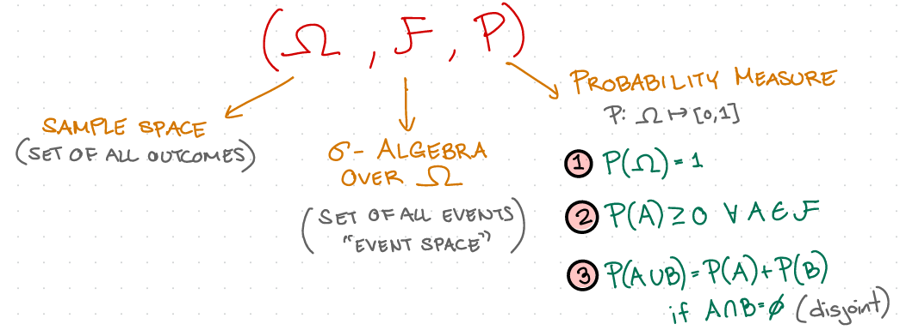
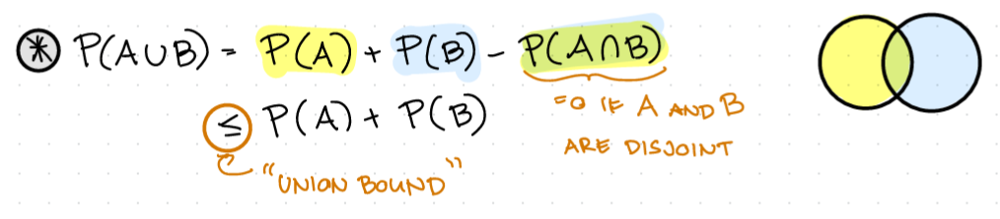

# Probability Theory

Recall: Information is the "Resolution of **Uncertainty**" (Realm of Probability Theory)

## Axiomatic approach to probability Theory

## Random Variable X:

$$\omega \rightarrow X(\omega)\ where\ \omega\ \in\Omega\ and\ X(\omega)\ \in \mathbb{R}$$
*Note: it is neither a random nor a variable, it is a **function**

## Probability Distribution (on a Finite Set $\mathcal{A}$)

$$P: \mathcal{A} \rightarrow [0,1]\ s.t.\ \sum_{a\in\mathcal{A}} P(a)=1$$

> e.g. Bernouilli: $\mathcal{A}={0,1}\ P(1)=p\ P(0)=1-p$ 
> 
> Uniform: $P(a) = |\frac{1}{\mathcal{A}}|\ \ \forall\ a\in\mathcal{A}$

Notation: X~P (X is distributed as P)
$\mathbb{P}(X=x)=P_x(X)=P_x(x)$

$\mathbb{P}(x\in S)=\sum_{x\in S}P(x)$

$\mathbb{P}(condition\ on\ x) = \sum P(x)$

X is a RV, $f$ is a function $\Rightarrow\ Y=f(x)$ is a RV
$$P_Y(y) = \sum_{x:f(x)=y}P(x)$$

$\mathbb{P}(X=x, Y=y) = P_{XY}(x, y) = P(x, y)$

$(X,Y)$ is a RV on $\mathcal{A}_X$ x $\mathcal{A}_Y$

## Contingency table
A way to visualize the probability of our bivariate variable

To check for independence, you have to check every entry of the contingency table and check if the equation P(x,y)=P(x)*P(y) holds

## Bayes Rule:

Posterior Distribution

$$P(x|y)=\frac{P(y|x)P(x)}{P(y)} = \frac{P(y|x)P(x)}{\sum_{x'\ \in\ \mathcal{A}_x}P(y|x')P(x')}$$

**Examples:**

1. Disease Testing

suppose $P(pos|sick)=P(neg|healthy)=90\%, P(sick)=1\%$
$\Rightarrow P(sick|pos)=\frac{0.9\cdot 0.1}0 9\cdot0.1+0.1\cdot0.99 = \frac{1}{12} < 10%}$

$\mathbb{P}(Y_1 = 0, Y_2 = 1) = \mathbb{P}(Y=010) + \mathbb{P}(Y=011)$

- $\mathbb{P}(Y = 010) = \mathbb{P}(W=0, Y=010) + \mathbb{P}(W=1, Y=010)$

  - $\mathbb{P}(W=0,Y=010)=\frac{1}{4}(\frac{2}{3})(\frac{1}{3})(\frac{2}{3})=\frac{1}{27}$
  - $\mathbb{P}(W=1,Y=010)=\frac{3}{4}(\frac{1}{3})(\frac{2}{3})(\frac{1}{3})=\frac{1}{18}$

  $\mathbb{P}(Y = 010) = \frac{1}{27} + \frac{1}{18} = \frac{5}{54}$

- $\mathbb{P}(Y = 011) = \mathbb{P}(W=0, Y=011) + \mathbb{P}(W=1, Y=011)$

  - $\mathbb{P}(W=0,Y=011)=\frac{1}{4}(\frac{2}{3})(\frac{1}{3})(\frac{1}{3})=\frac{1}{54}$
  - $\mathbb{P}(W=1,Y=011)=\frac{3}{4}(\frac{1}{3})(\frac{2}{3})(\frac{2}{3})=\frac{1}{9}$

  $\mathbb{P}(Y = 011) = \frac{1}{54} + \frac{1}{9} = \frac{7}{54}$

$\mathbb{P}(Y_1=0,Y_2=1)=\frac{5}{54} + \frac{7}{54} = \frac{2}{9}$