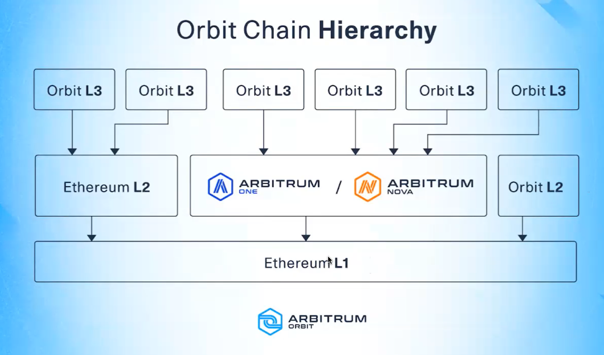
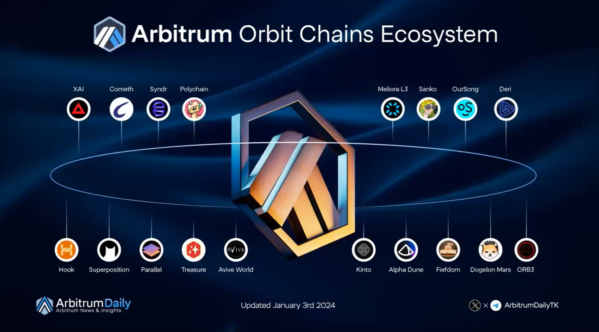

# Arbitrum 101

## What is Arbitrum

A layer 2 **scaling solution** for Ethereum developed by Offchain Labs.

Improves transaction performance while reducing transaction costs.

Uses Optimistic Rollups.

## What is Ethereum Layer 2

## Rollups

Rollups executes transaction, and every transaction ther is a state data. This performs the heavy calculation for Ethereum, and as a result, lowers the gas fees.

## Advantages and Disadvantages of Optimistic Rollups
Advantages:
- Faster
- Cheaoer
- Secured by Layer 1

Disadvantages:
- Time delay

## State of Affairs of Arbitrum

### Arbitrum Runtimes

Arbitrum Classic
- Initial Arbitrum stack was released in 2019
- Scaling solution was achieved by creating their own custom VM called AVM (Arbitrum Virtual Machine) which seeks to come close to EVM

Arbitrum Nitro
- Arbitrum current stack
- Launched in August 2022
- Uses WASM instead of their own VM
- Rewritten their ArbOS in Go and inherits already existing geth

Arbitrum Stylus
- Upcoming upgrade in Arbitrum
- Utilizes two VM's (EVM and WebAssembly VM)
- All programming languages that compiles in WASM can now be developed in Smart Contracts
- Supports programming language that are compilable to WASM (e.g. C, C++, Rust, etc.)
- Stylus is in alpha phase. It is now available on testnet.

## Arbitrum protocols/Chains

Arbitrum One
- Arbitrum's main protocol which uses optimistic rollups to batch transactions and settles them to L1.

Arbitrum Nova
- Handles transaction data off-chain via Data Availability Committee (DAC)
- Reverts to rollup only if there is a challenge

## Moving assets between Ethereum and Arbitrum

## Use cases of Arbitrum Protocols

### Arbitrum One
Protocol: Rollups

Higher Decetranlization and Security
Lower Scalability

Purpose: General

### Arbitrum Nova
Protocol: AnyTrust

High Scalability
Lower Decentralization and Security

Purpose: Games, Social

## Arbitrum Orbit Chains





## Arbitrum SDK

Typescript library for client-side interactions with Arbitrum. Arbitrum SDK provides common helper functionality as well as access to the underlying smart contract interfaces.

## Hardhat

It creates its own arbitrum sepolia inside your own PC.

## Solidity

Solidity is an object-oriented, high-level language for implementing smart contracts. Smart contracts are programs that govern the behavior of accounts within the Ethereum state.

### **License identifier, pragma** - to ensure compatibility
```
    // SPDX-License-Identifier: MIT
    pragma solidity ^0.8.0;
```

### **Contracts** - define the rules and structure
```
    contract HelloSolidity {
        uint63 balance;
        ...
    }
```
### **Data Types**
- Elementary types (e.g., uint, address, bool)
- Complex types (e.g., struct, mapping, array)

### **Types**
- bool
- uint (uint8 to uint256
  - uint = uint256 (defualt)
- int (int8 to int256)
- address
- bytes
- string
- mapping (dictionary-like)

### C++
OOP basics: what defines a class

### Hardhat

Easily deploy your contracts, run tests and debug Solidity code without dealing with live environments. Hardhat Network is a local Ethereum network designed for development.

Alternative: Truffle

**Fungible Token** - every instance has the same value. e.g. ERC20

**Non-fungible Token** - every instance can have different values. e.g. ERC720

---

### **Data Location**

**Storage (state variables)**
```
    contract Lock {
        uint public unlockTime; // This variable is in storage
        address payable public owner;
        ...
    }
```

**Memory**
```
    function myFunction() public pure returns(uint256[ memory]) {
        uint256[] memory temporaryArray = new uint256[](5); // This array is in memory
        return temporaryArray;
        ...
    }
```

### **Constructor** - executed only once when a contract is deployed
```
    coonstructor(string memory initialMessage) {
        messages[0] = initialMessage;
        owner = msg.sender;
    }
```

### **Modifers** - reusable pieces of code used to change the behavior of functions
Think of modifiers as middlewares
```
    modifier onlyOwner() {
        require(msg.sender === owner, "You are not the owner);
        _;
    }
```
**require** - checks if address of sender is equal to address of owner

### **Funcitons** - pieces of code that execute specific logic within the contract
```
    function storeMessage(uint256 index, string memory message) public onlyOwner {
        messages[index] = message;
    }
```

### **Function Visibility**
```
    function myFunction() <visibility specificer> returns (bool) {
        return true;
    }

    // public: visible externally and internally
    // private: only visible in the current contract
    // external: only visible externally (only for functions)
    // internal: only visible internally
```

### **Error** - An error will undo all changes made to the state during a transaction
```
...
error YouAreNotOwnerError();

contract HelloSolidity {
    ...
    modifier onlyOwner() {
        if (msg.sender != owner) {
            reverse YouAreNotOwnerError();
        }
    }
    ...
}
```

- **Require** - generally, has 2 arguments (boolean, string error_message)

return error_message when conditional statement is False

- **Revert**

like throwing an error; doesn't need a conditional statement

- **Assert**

checks the conditional statement; doesn't need error_message but throws an error 

### **Events** - useful for creating logs and triggering UI updates
```
    event MessageStored(string message);
    ...
    function storeMessage(
        uint256 index,
        string memory message
    ) public onlyOwner {
        messages[index] = message;
        emit MessageStored(message);
    }
    ...
```

### NatSpec Format - Natural Specification
https://docs.soliditylang.org/en/latest/natspec-format.html

### Style Guide
https://docs.soliditylang.org/en/latest/style-guide.html
