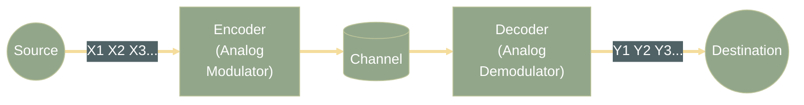
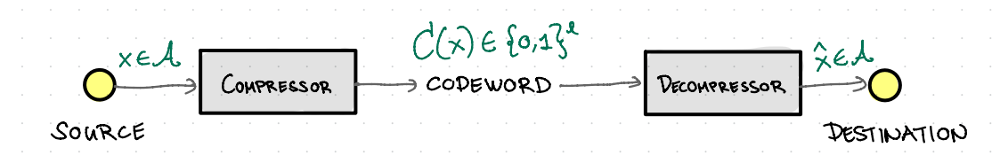
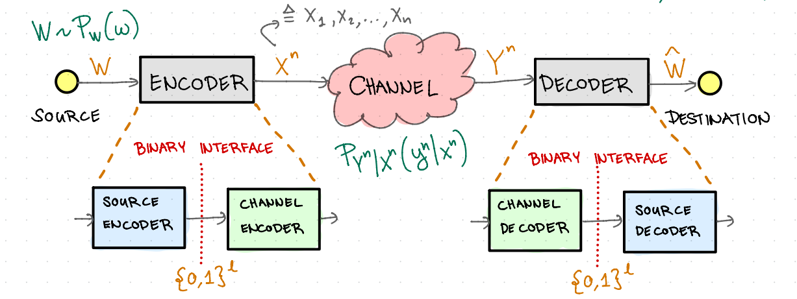
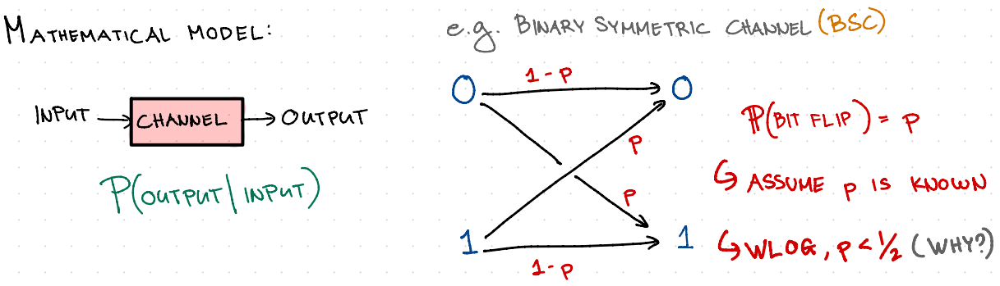
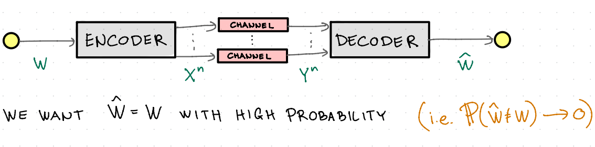
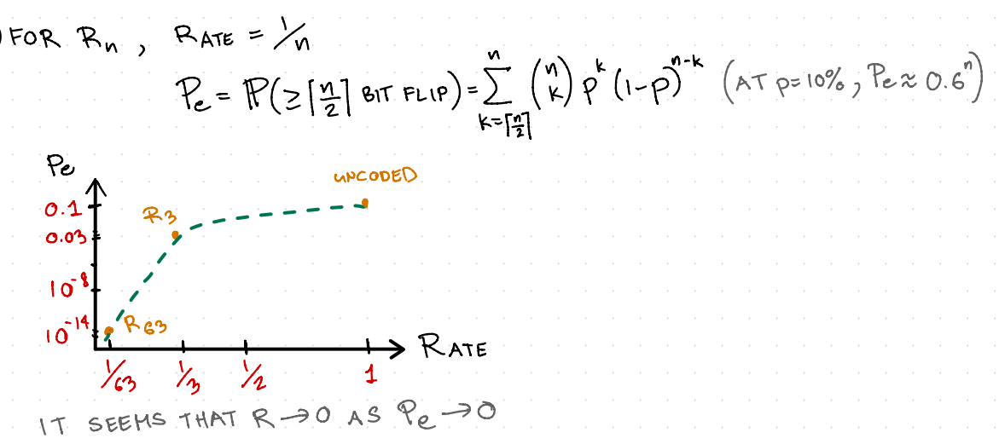
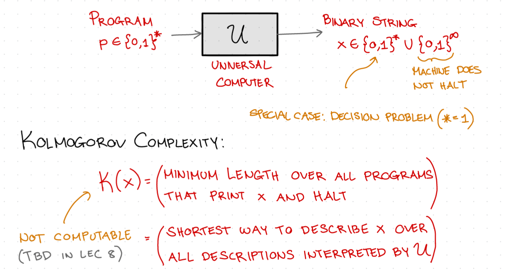
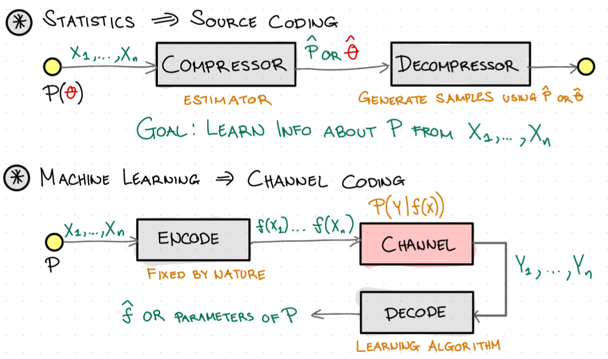

# Introduction to Information Theory

Communication is the transfer of **Information** from one point to another. 

Information Theory is all about **Quantification of Information**. When analyzing a message, we may care about:

|                                    | For Shannon |
|------------------------------------|:-----------:|
|1. The meaning of the message       |      ⬜    |
|2. How important the message is     |      ⬜    |
|3. How much information is conveyed |      ✅    | 

**Goal: $W={\hat{W}}$**

## **Given by Nature/Application**

**1. Source**
- Generates Information
- Represented by Signals

**2. Channel**
- Abstraction of the Physical Medium

## **Designed by Engineer**

**3. Encoder**
- Source $\to$ Channel Input
  
**4. Decoder**
- Channel output $\to$ estimate
- Operates under some metric (e.g. $\mathbb{P}(\hat{W}\neq{W})\leq\delta$)

## Analog View

**Goal: $\lim_{T\to\infty} \frac{1}{2T} \int_{-T}^T |\hat{W}(t) - W(t)|^2 dt\approx0$**

- To combat Noise, use High Transmit Power ($\uparrow$ Signal to Noise Ratio or SNR)
- Shannon Asked:

  1. If Rx knows that Tx sends a sinewave w/ unknown frequency, why not send the frequency?

  2. What are the necessary and sufficient conditions to reconstruct the message at the destination?

## Shannon's View

**Metrics: $R,\ \mathbb{P}(\hat{W}\neq W)$**

- Mathemtical Abstraction of Communication Problem
- Semantic vs. Syntactic definition of Information
- Information as ***"Resolution of Uncertainty"***
- Digital Paradigm **(Binary, Source-Channel Separation)**

## Compression 

**Goal: $\hat{X}=X$**

Suppose we want to compress a message in $\mathcal{A}=\{A,B,C,D\}$
- 4 Possible messages $\rArr$ need $\mathcal{l}\geq 2$ bits
  - In general, we need **$\mathcal{l}\geq log_2 (|\mathcal{A}|)$** bits where $|\mathcal{A}|$ is the set cardinality

|               |     |     |     |     |
|---------------|-----|-----|-----|-----|
|        X      |  A  |  B  |  C  |  D  |
|$C(X)$| 00  |  01 | 10  |  11 |

- Can we do better?
  - Yes, if symbols are not equiprobable

Consider:

|   |          |       | Code 1 |       Code 2         |
|---|----------|-------|--------|----------------------|
| A | Sunshine |  44%  |  10    |         10           |
| B | Rain     |  55%  |   0    |         0            |
| C | Snow     | 0.99% |  110   |         11           | 
| D | Hurricane| 0.01% |  111   |0 (reused codeword)| 

$$L_{AVE} = \sum_{x\in \mathcal{A}} P(x)\cdot l(C(x))$$

### Code 1: Lossless Compression
  $$L_{ave} = 1.46\ \frac{bits}{message}$$

### Code 2: Lossy Compression
  $$P_e = 0.01\%,\ L_{ave} = 1.45\ \frac{bits}{message}$$

Can we beat this? Look at the **Blocks of messages**
> Shannon: Optimal Compression Rate = $1.06\ \frac{bits}{message}$ 
> This is the Entropy of the Source

## Reliable Communication

### Examples of Noise Channels

- Loud Party $\to$ tell people not to shout
- Bad Signal  $\to$ build more cell tower
- Bit Flip on Hard Drive $\to$ better shielding
  - $\mathbb{P}$(Read Error)$\ \leq 10^{-14}$

## Problem: How to Reduce Errors
**Introduce Redundancy**

e.g. Repetition Code R3  

**Encoder**

| W | X = X1 X2 X3 |
|---|:------------:|
| 0 |    0 0 0     |
| 1 |    1 1 1     |

**Decoder**

| Y = Y1 Y2 Y3 | $\hat{W}$ |
|:------------:|:---------:|
|    0 0 0     |     0     |
| 001/010/100  |     0     |
| 011/101/110  |     1     |
|    111       |     1     |

This method of introducing redundancy allows us to deal with $\leq\ 1$ bit flips.

> $$P_e = \mathbb{P}(2\ or\ 3\ bit\ flips) = 3p^2(1-p) + p^3\approx 3p^2$$
> Note: $P_e\approx 3p^2$ when $p$ is small 
> e.g. $p = 10\%,\ P_e = 0.028\approx 3\%$

**Caveat:** $Rate = \frac{source\ bits}{\#\ channel\ use} = \frac{1}{3}$

> For $R_n,\ Rate\ =\ \frac{1}{n}$
>
> 	$P_e\ =\ \mathbb{P}(\geq \lceil\frac{n}{2}\rceil\ bit\ flip)\ =\ \sum^{n}_{k=\lceil\frac{n}{2}}\rceil(\substack{n\\k})p^k(1-p)^{n-k}$ (at $p=10\%,\ P_e \approx 0.6^n$)
> 	

| **Pre-Shannon:**            | **Shannon:**                 |
|-----------------------------|------------------------------|
| Rate $\to 0$ as $P_e \to 0$ | Rate $> 0$ as $P_e \to 0$ - Encode more than 1 symbol - Use (asymptotically) large block length $(n\to \infty)$ |

There is a a value of the **Channel Capacity C,** such that
$$\{\substack{\ rate<C,\ \exists\ code\ s.t\ P_e\to0 \\ \\
rate>C,\nexists\ code\ s.t\ P_e\to0}$$

## Computation Complexity (Kolmogorov)

> Kolmogorov, Chaitin, and Solomonoff put forth the idea that the complexity of a string of data can be defined by the ***length of the shortest binary computer program for computing the string***. Thus, the complexity is the **minimal description length**. 

> This definition of complexity turns out to be universal, that is, computer independent, and is of fundamental importance. Thus, Kolmogorov complexity lays the foundation for **the theory of descriptive complexity**. 

> Gratifyingly, the Kolmogorov complexity K is approximately equal to the Shannon entropy H if the sequence is drawn at random from a distribution that has entropy H. So the tie-in between information theory and Kolmogorov complexity is perfect. Indeed, we consider Kolmogorov complexity to be more fundamental than Shannon entropy. **It is the ultimate data compression** and leads to a logically consistent procedure for inference.

> There is a pleasing complementary relationship between algorithmic complexity and computational complexity. One can think about computational complexity (time complexity) and Kolmogorov complexity (program length or descriptive complexity) as two axes corresponding toprogram running time and program length. Kolmogorov complexity focuses on minimizing along the second axis, and computational complexity focuses on minimizing along the first axis. Little work has been done on the simultaneous minimization of the two.

### Kolmogorov Complexity:

$$K(x)=(Minimum\ length\ over\ all\ programs\ that\ print\ x\ and\ halt)$$
$$=(Shortest\ way\ to\ describe\ x\ over\ all\ descriptions\ interpreted\ by\ \mathcal{U})$$

Suppose $P$ is random, $X=\mathcal{U}(P)$ is also random. Where $\mathcal{U}(P)$ is the deterministic machine

If $X=x_1x_2x_3\dotso x_n,$ where $x_i\ 's$ are I.I.D., we can bound the average $k(x)$:

$$Entropy\leq\frac{\exists[k(x_1x_2\dotso x_n)]}{n}\leq Entropy + \frac{2log_2n}{n} + \frac{C}{n}$$

**Key Idea:** Treat as compression Problem

## Statistics and Machine Learning

## Additional Notes:

### Channel Capacity
- Is the ultimate transmission rate of communication

### Entropy
- Is the minimum descriptive complexity of a random variable
- Is the ultimate data compression

The entropy of a random variable X with a probabilty mass function p(x) is defined by: 
$$H(x)=-\sum_x p(x)log_2p(x)$$
The entropy is a measure of the average uncertainty in the random variable. It is the number of bits on average required to describe the random variable.

#### Example 1: 
Consider a random variable that has a **uniform distribution** over **32 outcomes**. To identify an outcome, we need a label that takes on 32 different values. Thus, 5-bit strings suffice as labels.

The entropy of this random variable is
$$H(x)=-\sum_{i=1}^{32}\frac{1}{32}log_2\frac{1}{32}=-32\cdot\frac{1}{32}log_2\frac{1}{32}=-(-5)=5\ bits$$

#### Example 1: 
Now consider an example with **nonuniform distribution.** Suppose that we have a horse race with eight horses taking part. Assume that the probabilities of winning for the eight horses
are $(\frac{1}{2},\frac{1}{4},\frac{1}{8},\frac{1}{16},\frac{1}{64},\frac{1}{64},\frac{1}{64},\frac{1}{64})$. We can calculate the entropy of the horse race as:

$H(x)=-\frac{1}{2}log\frac{1}{2}-\frac{1}{4}log\frac{1}{4}-\frac{1}{8}log\frac{1}{8}-\frac{1}{16}log\frac{1}{16}-4\cdot\frac{1}{64}log\frac{1}{64}$

$=\frac{1}{2}+\frac{1}{2}+\frac{3}{8}+\frac{1}{4}+\frac{3}{8}$
$=1+1$
$=2\ bits$

